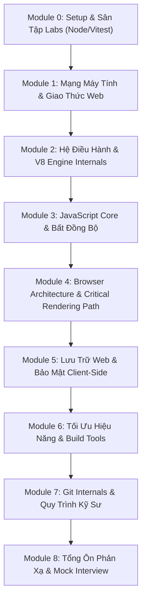

# 🚀 IT Core Knowledge & Frontend Intern Mastery

> Giáo trình hệ thống hóa và đào sâu bản chất kiến thức **IT Core & Frontend Fundamentals** theo tư duy **Bottom-Up** — chuẩn bị toàn diện cho các vòng phỏng vấn kỹ thuật và công việc thực tế tại các công ty công nghệ.

---

## 🌟 Điểm Nổi Bật của Khóa Học

- 🎯 **Tư duy Bottom-Up vững chắc:** Đi từ tầng sâu nhất của phần cứng/mạng lên đến trình duyệt: *Giao thức mạng → Cấp phát RAM & OS Process/Thread → V8 Engine & GC → Event Loop & Async → Browser Rendering 60fps → Web Security đa lớp*.
- 🧪 **Sân tập thực hành có kiểm chứng (`core-practice`):** Không học "chay". Mọi kịch bản race condition, memory leak, Event Loop, Promise combinators đều có suite test tự động viết bằng **Vitest** chạy xanh trên máy thật.
- 💼 **100% Bài học tích hợp "Bộ câu hỏi thực tế ôn tập":** Mỗi bài đều trang bị 3–5 câu hỏi phỏng vấn kinh điển, giải thích bản chất, phân tích bẫy tư duy và barem câu trả lời 60 giây (Elevator Pitch).
- 🎨 **Giao diện bài học UX Dark-Mode:** File HTML tự chứa (self-contained) thiết kế đẹp mắt, mở trực tiếp bằng trình duyệt, có quiz tương tác chấm điểm tức thì và nút copy code tiện lợi.
- 📖 **Hồ sơ học tập chuẩn mực:** Tích hợp sổ tay thuật ngữ [`GLOSSARY.md`](./GLOSSARY.md) và nhật ký nhận thức [`learning-records/`](./learning-records/).

---

## 🗺️ Lộ Trình Tổng Quan (9 Modules · 30 Bài Học)



| Module | Chủ Đề Chính | Số Bài | Trạng Thái |
| :--- | :--- | :---: | :---: |
| **Module 0** | **Setup & Sân Tập Labs** (Node.js ESM, Vitest Test Runner) | 1 bài | ✅ Sẵn sàng |
| **Module 1** | **Mạng Máy Tính & Giao Thức Web** (DNS, TCP 3-Way Handshake, TLS 1.3, HTTP/1-2-3, REST, Realtime, Caching, CORS) | 7 bài | ⏳ Sắp tới |
| **Module 2** | **Hệ Điều Hành & V8 Internals** (Process vs Thread, V8 Ignition/TurboFan, Generational GC, Memory Leaks) | 3 bài | ✅ Sẵn sàng |
| **Module 3** | **JavaScript Core & Bất Đồng Bộ** (Execution Context, Scope, Closures, Prototype, `this`, Event Loop, Promises, ES6+) | 5 bài | 🔄 Đang triển khai |
| **Module 4** | **Trình Duyệt & Critical Rendering Path** (Multi-Process, DOM/CSSOM, Layout, Paint, GPU Composite, DOM Events) | 4 bài | ⏳ Sắp tới |
| **Module 5** | **Lưu Trữ Web & Bảo Mật Client-Side** (Cookies, Storage, IndexedDB, JWT/Session, XSS, CSRF, CSP, Security Headers) | 4 bài | ⏳ Sắp tới |
| **Module 6** | **Tối Ưu Hiệu Năng & Build Tools** (Core Web Vitals LCP/INP/CLS, Resource Hints, Bundling, Code Splitting) | 3 bài | ⏳ Sắp tới |
| **Module 7** | **Git Internals & Quy Trình Kỹ Sư** (Object Store Blob/Tree/Commit, DAG, Merge vs Rebase, Conventional Commits) | 2 bài | ⏳ Sắp tới |
| **Module 8** | **Tổng Ôn Phản Xạ & Mock Interview** (Full-Trace System Thinking, 50 Câu hỏi phỏng vấn kinh điển) | 2 bài | ⏳ Sắp tới |

---

## ⚡ Hướng Dẫn Bắt Đầu & Thực Hành

### 1. Xem Mục Lục & Bài Học
Bạn chỉ cần mở trực tiếp file mục lục bằng trình duyệt web:
```bash
# Mở mục lục bài học trên trình duyệt
# (Hoặc double click vào file lessons/index.html)
start lessons/index.html        # Trên Windows
# open lessons/index.html       # Trên macOS
# xdg-open lessons/index.html   # Trên Linux
```

### 2. Cài Đặt & Chạy Sân Tập Code
```bash
# Di chuyển vào thư mục sân tập
cd core-practice

# Cài đặt dependencies (Vitest)
npm install

# Chạy toàn bộ test suites kiểm chứng
npm test
```

---

## 🌿 Quy Ước Git Branching
Mỗi khi bắt đầu một bài học mới trong lộ trình, luôn tạo một nhánh riêng biệt theo quy chuẩn:
```bash
# Tạo và chuyển sang branch bài học mới
git checkout -b lesson/<so-thu-tu>-<ten-bai-ngan-gon>

# Ví dụ:
git checkout -b lesson/01-dns-tcp-handshake
git checkout -b lesson/14-async-promise-internals
```
Sau khi hoàn thành bài học, commit theo chuẩn **Conventional Commits** và tạo Pull Request hoặc push lên remote repository.

---

## 📚 Tài Liệu Tham Khảo Chính Thức
- [MDN Web Docs — Web Standards & Browser APIs](https://developer.mozilla.org)
- [web.dev by Google — Browser Architecture & Performance](https://web.dev)
- [javascript.info — The Modern JavaScript Tutorial](https://javascript.info)
- [V8 Dev Blog — Inside the V8 Engine](https://v8.dev/blog)
- [WHATWG HTML Living Standard](https://html.spec.whatwg.org)

---

*Học sâu bản chất · Rèn luyện phản xạ · Tự tin chinh phục mọi vòng phỏng vấn kỹ thuật!*
